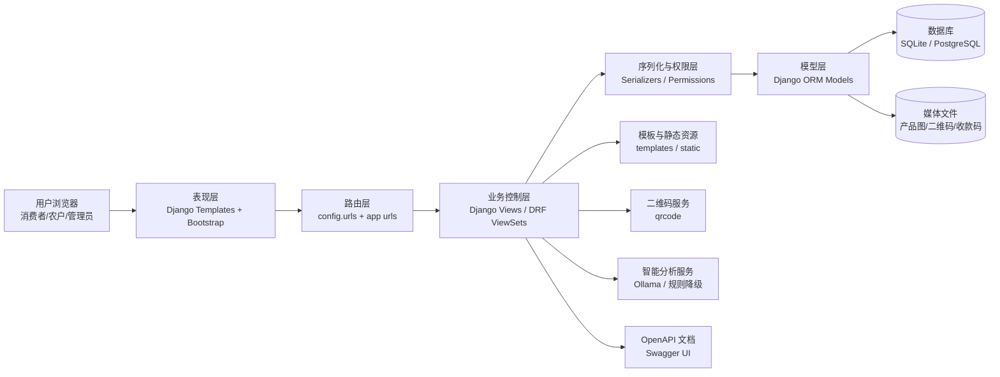
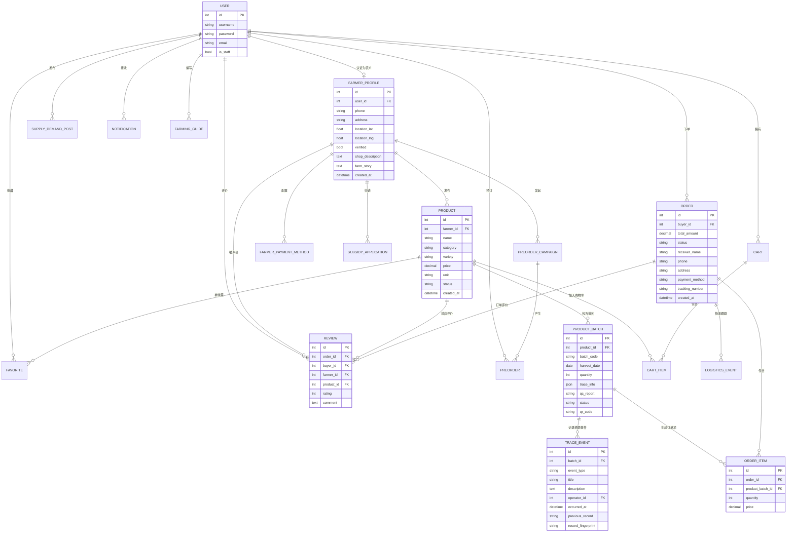
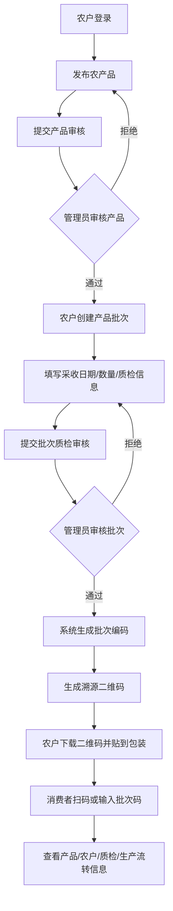
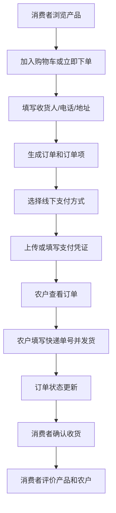
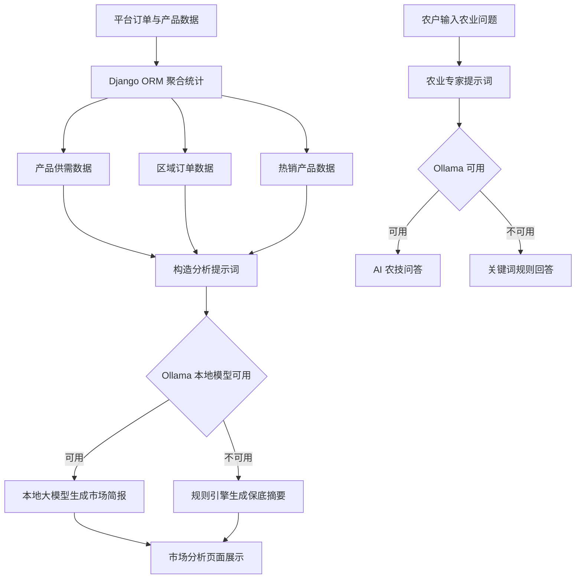
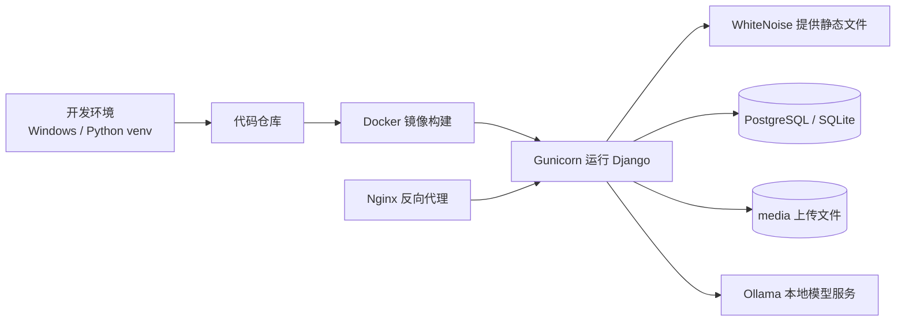

# 基于 Django 与大模型的农产品溯源与智能助农平台

> 毕业设计答辩 PPT 大纲  
> 建议页数：18 页左右；答辩时长：8-12 分钟；演示时长：2-3 分钟  
> 项目路径：`D:\pythonweb助农\pythonweb`

---

## 1. 封面

**标题：** 基于 Django 与大模型的农产品溯源与智能助农平台设计与实现  
**副标题：** 面向农户、消费者和平台管理员的农产品可信交易与助农服务平台  
**展示信息：** 学校、学院、专业、姓名、学号、指导教师、答辩日期。

**答辩讲法：**  
本课题围绕农产品销售渠道单一、溯源信息不透明、农户数字化服务不足等问题，设计并实现了一个集产品展示、批次溯源、在线交易、供需对接、农技知识库和 AI 助农分析于一体的 Web 平台。

---

## 2. 研究背景与问题分析

**PPT 内容：**
- 农产品流通过程中存在信息不对称，消费者难以判断产品来源与质量。
- 中小农户线上销售能力弱，缺少稳定的展示、交易和获客渠道。
- 农产品生产、质检、物流等环节信息分散，质量问题追责困难。
- 数字乡村和乡村振兴背景下，需要低成本、易部署、易使用的助农平台。

**建议配图：** 农户、消费者、平台三方关系图。

---

## 3. 课题目标与研究意义

**建设目标：**
- 为农户提供产品发布、批次管理、收款方式、订单处理、补贴申请等能力。
- 为消费者提供农产品浏览、购物车、下单、收藏、评价和扫码溯源能力。
- 为管理员提供商品审核、批次质检审核、用户管理、订单导出和入驻审核能力。
- 引入数据统计和本地大模型分析，为农户提供市场需求参考。

**研究意义：**
- 提升农产品流通透明度和消费者信任度。
- 拓展农户线上销售渠道，辅助农户做出生产和销售决策。
- 将 Django、DRF、二维码、链式结构溯源记录、ECharts 和本地大模型用于农业数字化场景。

---

## 4. 系统总体需求分析

**用户角色：**
- 游客：浏览首页、产品、农技知识、供需信息、溯源查询。
- 消费者：注册登录、加入购物车、下单、收藏、评价、查看订单。
- 农户：维护农户档案、管理产品和批次、下载二维码、处理订单、发起预售、申请补贴。
- 管理员：审核产品、审核批次、管理用户、处理入驻申请、导出业务数据。

**非功能需求：**
- 安全性：登录认证、CSRF 防护、权限控制、密码加密存储。
- 易用性：Bootstrap 响应式页面，适配普通浏览器访问。
- 可维护性：按 Django App 拆分业务模块，使用 ORM 管理数据模型。
- 可部署性：支持 Docker、Gunicorn、WhiteNoise 和 PostgreSQL 生产部署。

---

## 5. 功能模块结构图

```mermaid
flowchart TD
    A[农产品溯源与智能助农平台] --> B[用户与权限模块]
    A --> C[农产品管理模块]
    A --> D[批次溯源模块]
    A --> E[交易订单模块]
    A --> F[助农服务模块]
    A --> G[数据分析模块]
    A --> H[后台管理模块]

    B --> B1[注册登录]
    B --> B2[农户档案]
    B --> B3[角色识别]

    C --> C1[产品发布]
    C --> C2[产品审核]
    C --> C3[产品列表与详情]
    C --> C4[农户店铺]

    D --> D1[批次创建]
    D --> D2[质检审核]
    D --> D3[二维码生成]
    D --> D4[扫码查询]
    D --> D5[溯源事件链式记录]

    E --> E1[购物车]
    E --> E2[订单提交]
    E --> E3[线下支付凭证]
    E --> E4[物流跟踪]
    E --> E5[评价反馈]

    F --> F1[补贴申请]
    F --> F2[供需对接]
    F --> F3[预售认养]
    F --> F4[农技知识库]
    F --> F5[农技培训]

    G --> G1[ECharts 可视化]
    G --> G2[区域需求统计]
    G --> G3[供需缺口分析]
    G --> G4[Ollama 智能简报]

    H --> H1[产品审核]
    H --> H2[批次审核]
    H --> H3[用户管理]
    H --> H4[入驻审核]
    H --> H5[数据导出]
```

---

## 6. 技术路线与开发环境

| 层次 | 技术 | 项目中的作用 |
|---|---|---|
| 后端框架 | Django 5.2 | Web 业务开发、模板渲染、ORM、认证系统 |
| API 框架 | Django REST Framework | 构建 RESTful API，支持前后端数据交互 |
| API 文档 | drf-spectacular | 自动生成 OpenAPI / Swagger 文档 |
| 前端页面 | Django Templates + Bootstrap 5 | 响应式页面、表单、列表、后台管理界面 |
| 可视化 | ECharts | 首页看板、市场分析、地图和统计图表 |
| 数据库 | SQLite / PostgreSQL | 本地开发使用 SQLite，生产部署可切换 PostgreSQL |
| 溯源 | qrcode + 链式结构记录机制 | 批次二维码生成、溯源记录防篡改设计 |
| 智能分析 | 本地大模型（Ollama） | 生成市场需求分析和农业问答 |
| 部署 | Docker + Gunicorn + WhiteNoise | 容器化部署和静态资源服务 |

---

## 7. 系统总体架构图

**答辩讲法：**  
系统采用典型 B/S 架构。浏览器访问 Django 路由，业务逻辑由各 App 的 Views 和 DRF ViewSets 处理，数据通过 Django ORM 持久化。二维码、媒体文件、AI 分析、Swagger 文档作为辅助服务集成在平台中。

---

## 8. 程序结构图

```mermaid
flowchart TD
    P[pythonweb 项目根目录] --> C[config<br/>项目配置]
    P --> A[accounts<br/>账号与农户档案]
    P --> PR[products<br/>产品/批次/评价]
    P --> TR[traceability<br/>溯源事件]
    P --> TD[trade<br/>购物车/订单/收藏/物流]
    P --> MP[marketplace<br/>供需对接]
    P --> KN[knowledge<br/>农技知识库]
    P --> PO[preorder<br/>预售认养]
    P --> NO[notifications<br/>站内通知]
    P --> AN[analysis<br/>市场分析/AI 助手]
    P --> AD[admin_panel<br/>自定义后台管理]
    P --> CO[core<br/>首页/培训/公告/通用 API]
    P --> TM[templates<br/>页面模板]
    P --> ST[core/static<br/>CSS 静态资源]
    P --> ME[media<br/>上传图片和二维码]
    P --> DP[deploy / scripts<br/>部署脚本]

    C --> C1[settings.py<br/>应用/数据库/静态资源配置]
    C --> C2[urls.py<br/>统一路由入口]
    C --> C3[wsgi.py<br/>生产环境入口]

    PR --> PR1[models.py<br/>Product/ProductBatch/Review]
    TD --> TD1[models.py<br/>Order/Cart/Favorite/LogisticsEvent]
    AN --> AN1[llm_service.py<br/>Ollama 调用与规则降级]
```

---

## 9. 数据库 E-R 图

> PPT 可以拆成两页：第一页放核心交易与溯源实体，第二页放助农扩展实体。

---

## 10. 主要数据表说明

| 数据表 | 对应模型 | 作用 |
|---|---|---|
| `core_farmerprofile` | FarmerProfile | 保存农户联系方式、地址、经纬度、店铺简介、农场故事等信息 |
| `core_product` | Product | 保存农产品名称、分类、品种、价格、单位、审核状态 |
| `core_productbatch` | ProductBatch | 保存产品批次、采收日期、数量、质检报告、二维码和批次状态 |
| `core_traceevent` | TraceEvent | 保存种植、施肥、采收、质检、入库、发货等溯源事件，并形成链式记录 |
| `core_order` | Order | 保存消费者订单、收货信息、支付方式、物流状态 |
| `core_orderitem` | OrderItem | 保存订单中的具体批次、数量和成交价格 |
| `core_cart` / `core_cartitem` | Cart / CartItem | 保存购物车与购物车明细 |
| `core_review` | Review | 保存订单评价、评分和评论 |
| `core_subsidyapplication` | SubsidyApplication | 保存农户补贴申请和管理员审核结果 |
| `core_supplydemandpost` | SupplyDemandPost | 保存供应和需求帖子 |
| `core_preordercampaign` / `core_preorder` | PreOrderCampaign / PreOrder | 保存预售活动和消费者预订记录 |

---

## 11. 核心业务流程一：产品批次溯源

**实现要点：**
- `ProductBatch.save()` 在批次通过审核且没有批次码时自动生成 `B-日期-随机串` 格式的批次编码。
- `ensure_qr_code()` 使用 `qrcode` 库生成二维码，二维码指向 `/trace/<batch_code>/`。
- `TraceEvent` 采用基于链式结构的溯源记录机制，增强溯源记录的防篡改表达能力。

---

## 12. 核心业务流程二：购物车、订单与评价

**实现要点：**
- `Order` 保存买家、总金额、收货信息、支付凭证、快递单号和状态流转。
- `OrderItem` 关联具体 `ProductBatch`，保证订单能追溯到实际批次。
- `Review` 关联订单、买家、农户和产品，用于建立消费者反馈机制。

---

## 13. 核心业务流程三：AI 市场分析与农技问答

**实现要点：**
- `analysis/llm_service.py` 封装本地 Ollama 调用。
- 当模型不可用时，系统自动回退到规则摘要，保证页面功能可用。
- 市场分析结合产品销量、库存和地区订单，为农户提供生产销售建议。

---

## 14. 关键模块实现说明

**用户与权限：**
- 使用 Django 内置 `User` 完成注册、登录、退出和管理员识别。
- 通过农户档案 `FarmerProfile` 区分普通消费者和农户。
- 农户页面和管理员页面分别使用装饰器限制访问。

**产品与批次：**
- 产品状态包括草稿、待审核、已上架、未通过。
- 批次状态包括草稿、待质检、已通过、未通过。
- 通过状态流转控制二维码生成和前台展示。

**订单与支付：**
- 采用线下支付模拟方案，支持收款方式管理和支付凭证记录。
- 农户可处理订单并填写物流单号。

**通知与后台：**
- `Notification` 保存订单、批次、产品和系统消息。
- 自定义后台 `admin_panel` 提供仪表盘、审核、用户管理和数据导出。

---

## 15. 系统页面与演示路线

**建议现场演示顺序：**
1. 首页：展示平台定位、产品推荐、数据看板。
2. 产品列表：按分类、地区、价格查看农产品。
3. 产品详情：查看农户、价格、评价、批次入口。
4. 消费者下单：加入购物车、提交订单、查看订单。
5. 农户后台：发布产品、创建批次、下载二维码、处理订单。
6. 溯源查询：输入批次码或访问二维码链接查看溯源详情。
7. 市场分析：展示供需分析、区域统计和 AI 简报。
8. 管理后台：展示产品审核、批次审核、用户管理、入驻审核。

**建议截图：**
- 首页看板
- 产品列表/详情页
- 农户批次管理页
- 溯源结果页
- 市场分析页
- 管理员审核页

---

## 16. 系统测试

**测试内容：**
- 用户注册、登录、退出流程。
- 农户产品发布、编辑、提交审核流程。
- 管理员产品审核、批次审核流程。
- 批次二维码生成与溯源查询流程。
- 购物车、下单、支付凭证、物流、评价流程。
- API 接口访问和权限校验。
- 页面加载、表单校验、异常输入处理。

**测试方式：**
- 单元测试：模型创建、字段校验、关键方法测试。
- 接口测试：DRF API 列表、详情、权限访问测试。
- 功能测试：使用浏览器按角色完成主流程。
- 兼容性测试：桌面端和移动端浏览器页面适配。

**PPT 可放表格：**
| 测试项 | 输入/操作 | 预期结果 | 实际结果 |
|---|---|---|---|
| 用户登录 | 正确账号密码 | 登录成功并跳转首页 | 通过 |
| 产品审核 | 管理员点击通过 | 产品状态变为已上架 | 通过 |
| 批次溯源 | 输入有效批次码 | 展示产品和溯源事件 | 通过 |
| 订单提交 | 填写收货信息 | 生成订单记录 | 通过 |
| AI 分析 | 访问市场分析页 | 展示统计与分析摘要 | 通过 |

---

## 17. 项目创新点与特色

**创新点：**
- 将农产品电商交易与批次溯源结合，订单项直接关联具体产品批次。
- 使用二维码降低消费者查询成本，实现扫码查看产品来源与质检信息。
- 溯源事件采用基于链式结构的记录机制，增强数据可信表达。
- 引入本地 Ollama 大模型，基于订单和供需数据生成市场简报。
- 提供大模型不可用时的规则降级方案，提升系统稳定性。
- 覆盖农户入驻、产品审核、批次质检、补贴申请、供需对接、预售认养等助农场景。

---

## 18. 部署方案

**部署说明：**
- 本地开发：`python manage.py migrate` 后运行 `python manage.py runserver`。
- 生产部署：使用 Docker Compose 启动 Django、数据库和反向代理服务。
- 静态文件：通过 WhiteNoise 或 Nginx 提供。
- 数据库：开发阶段使用 SQLite，部署阶段可切换 PostgreSQL。

---

## 19. 总结与展望

**工作总结：**
- 完成了农产品溯源与助农平台的需求分析、架构设计、数据库设计和编码实现。
- 实现了用户、农户、产品、批次、订单、评价、供需、预售、农技、通知和后台审核等模块。
- 实现了二维码批次溯源和基于链式结构的溯源事件记录。
- 实现了市场分析和农业智能问答功能，增强系统的助农价值。

**不足与展望：**
- 后续可接入微信小程序，提高移动端使用便利性。
- 可接入真实在线支付接口，实现完整支付闭环。
- 可结合物联网设备自动采集温湿度、地理位置、质检数据。
- 可将核心溯源记录接入存证平台，提高跨平台可信程度。
- 可继续优化推荐算法，实现个性化农产品推荐和价格预测。

---

## 20. Q&A 准备页

**老师可能问 1：你的系统和普通电商平台有什么区别？**  
答：普通电商主要解决展示和交易问题，本系统除了交易外，还围绕农产品特点加入了批次溯源、质检审核、二维码查询、农技知识、补贴申请、供需对接和 AI 市场分析，更强调“可信来源”和“助农服务”。

**老师可能问 2：溯源信息如何保证可信？**  
答：系统将每个产品批次生成唯一批次编码和二维码，消费者查询的是具体批次信息；同时溯源事件采用基于链式结构的溯源记录机制，具备防篡改设计基础，后续可以扩展到可信存证平台。

**老师可能问 3：为什么选择 Django？**  
答：Django 内置 ORM、用户认证、后台管理、表单安全和模板系统，适合快速开发管理型 Web 平台；配合 DRF 可以生成 RESTful API，方便后续扩展移动端或小程序。

**老师可能问 4：大模型不可用怎么办？**  
答：系统在 `llm_service.py` 中做了降级设计，优先调用本地 Ollama 模型生成分析结果；如果模型服务超时或连接失败，会使用规则引擎生成摘要，保证功能页面仍然可用。

**老师可能问 5：数据库设计的核心关系是什么？**  
答：核心关系是“用户 - 农户档案 - 产品 - 产品批次 - 溯源事件”和“用户 - 订单 - 订单项 - 产品批次”。前者支撑溯源，后者支撑交易，并且订单项关联批次，可以追溯消费者购买的具体产品来源。

**老师可能问 6：系统权限如何控制？**  
答：登录认证使用 Django 内置认证体系；农户功能需要用户存在 `FarmerProfile`；管理员功能需要用户具备 staff 权限；同时 DRF API 也配置了认证和权限控制。

---

## 答辩 PPT 页数压缩建议

如果老师要求 10 分钟内完成，可以压缩为 15 页：

1. 封面  
2. 背景与意义  
3. 系统目标  
4. 需求分析  
5. 功能模块图  
6. 技术路线  
7. 系统架构图  
8. 数据库 ER 图  
9. 程序结构图  
10. 批次溯源流程  
11. 订单交易流程  
12. AI 分析实现  
13. 系统测试  
14. 创新点与不足  
15. 总结与 Q&A  
